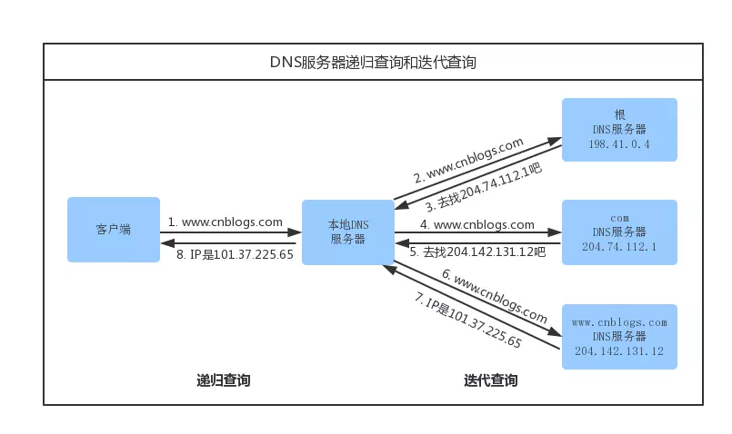
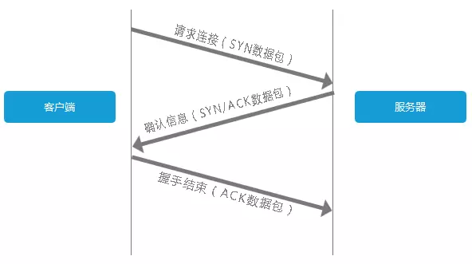
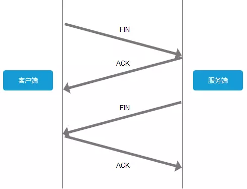

# 题目

**细说浏览器输入URL后发生了什么？**


# 解析

浏览器输入URL后到页面渲染出来，一共可以分为八步来解析，所以叫前端的 “天龙八步”。接下来我们就一步一步来学习记录过程。

* ####  第一步：DNS（Domain Name Server，域名服务器） 域名解析

我们在浏览器输入网址，其实就是要向服务器请求我们想要的页面内容，所有浏览器首先要确认的是域名所对应的服务器在哪里。将域名解析成对应的服务器IP地址这项工作，是由[DNS服务器](https://baike.baidu.com/item/%E5%9F%9F%E5%90%8D%E6%9C%8D%E5%8A%A1%E5%99%A8/9705133?fromtitle=DNS%E6%9C%8D%E5%8A%A1%E5%99%A8&fromid=8079460&fr=aladdin)来完成的。

当一个浏览者在浏览器地址框中打入某一个域名，或者从其他网站点击了链接来到了这个域名，浏览器向这个用户的上网接入商发出域名请求，接入商的DNS服务器要查询域名数据库，看这个域名的DNS服务器是什么。然后到DNS服务器中抓取DNS记录，也就是获取这个域名指向哪一个IP地址。在获得这个IP信息后，接入商的服务器就去这个IP地址所对应的服务器上抓取网页内容，然后传输给发出请求的浏览器。



浏览器客户端向本地DNS服务器发送一个含有域名www.cnblogs.com的DNS查询报文。本地DNS服务器把查询报文转发到根DNS服务器，根DNS服务器注意到其com后缀，于是向本地DNS服务器返回comDNS服务器的IP地址。本地DNS服务器再次向comDNS服务器发送查询请求，comDNS服务器注意到其www.cnblogs.com后缀并用负责该域名的权威DNS服务器的IP地址作为回应。最后，本地DNS服务器将含有www.cnblogs.com的IP地址的响应报文发送给客户端。

从客户端到本地服务器属于**递归查询**，而DNS服务器之间的交互属于**迭代查询**。

* #### 第二步：建立TCP链接

拿到服务器IP了，下一步自然就是链接到该服务器。对于客户端与服务器的TCP链接，必然要说的就是『三次握手』。



三次握手相当于，一个人去朋友家玩，达成了协议一样：

A：家里有人没？到你家玩去；

B：有人的，来吧；

A：好，这就去！

***参考资料***

 [SYN数据包](https://baike.baidu.com/item/SYN/8880122?fr=aladdin)

[ACK数据包](https://baike.baidu.com/item/ACK/3692629?fr=aladdin)

* #### 第三步：发送HTTP请求

与服务器建立了连接后，就可以向服务器发起请求了。请求行包括请求方法、URI、HTTP版本。首部字段传递重要信息，包括请求首部字段、通用首部字段和实体首部字段。我们可以从报文中看到发出的请求的具体信息。详细请求报文和返回报文后续详细说明。

* #### 第四步：服务器处理请求

服务器端收到请求后的由web服务器（准确说应该是http服务器）处理请求，诸如Apache、Ngnix、IIS等。web服务器解析用户请求，知道了需要调度哪些资源文件，再通过相应的这些资源文件处理用户请求和参数，并调用数据库信息，最后将结果通过web服务器返回给浏览器客户端。

* #### 第五步：返回响应结果

在HTTP里，有请求就会有响应，哪怕是错误信息。

在响应结果中都会有个一个HTTP状态码，比如我们熟知的200、301、404、500等。通过这个状态码我们可以知道服务器端的处理是否正常，并能了解具体的错误。

关于HTTP状态码描述，请参考 [HTTP请求方法 和状态码](20190114.md)

* #### 第六步： 关闭TCP连接

为了避免服务器与客户端双方的资源占用和损耗，当双方没有请求或响应传递时，任意一方都可以发起关闭请求。与创建TCP连接的3次握手类似，关闭TCP连接，需要4次握手。



上图可以这么理解：

客户端：“兄弟，我这边没数据要传了，咱关闭连接吧。”

服务端：“收到，我看看我这边有木有数据了。”

服务端：“兄弟，我这边也没数据要传你了，咱可以关闭连接了。”

客户端：“好嘞。”

没有搞明白，为何第三步和第四步不能一块，直接告诉客户端没有数据传输了不就行了？

* #### 第七步：浏览器解析HTML

浏览器需要加载解析的不仅仅是HTML，还包括CSS、JS。以及还要加载图片、视频等其他媒体资源。

浏览器通过解析HTML，生成DOM树，解析CSS，生成CSS规则树，然后通过DOM树和CSS规则树生成渲染树。渲染树与DOM树不同，渲染树中并没有head、display为none等不必显示的节点。

* #### 第八步：浏览器布局渲染

根据渲染树布局，计算CSS样式，即每个节点在页面中的大小和位置等几何信息。HTML默认是流式布局的，CSS和js会打破这种布局，改变DOM的外观样式以及大小和位置。这时就要提到两个重要概念：replaint和reflow。

```
replaint：屏幕的一部分重画，不影响整体布局，比如某个CSS的背景色变了，但元素的几何尺寸和位置不变。

reflow： 意味着元件的几何尺寸变了，我们需要重新验证并计算渲染树。是渲染树的一部分或全部发生了变化。这就是Reflow，或是Layout。
```

### 总结

1.DNS域名解析；

2.建立TCP连接；

3.发送HTTP请求；

4.服务器处理请求；

5.返回响应结果；

6.关闭TCP连接；

7.浏览器解析HTML；

8.浏览器布局渲染[渲染详解请点](https://baijiahao.baidu.com/s?id=1593097105869520145&wfr=spider&for=pc)；

### 参考资料

 本文主要摘自网上博客，弄下来增加印象，参考文献 [天龙八步](https://www.jianshu.com/p/b7207077fa96)