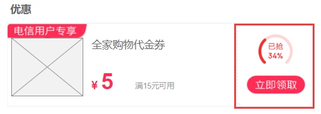

# 题目

270deg弧形进度条的绘制-Canvas

## 答案
// html部分
```javascript
<canvas id="canvas" width="300" height="300" style="background:fff;"></canvas>
```
// javascript(canvas)部分
```javascript
window.onload = function(){
    var canvas = document.getElementById('canvas'),  // 获取canvas元素
        context = canvas.getContext('2d'),  // 获取画图环境，指明为2d
        centerX = canvas.width / 2,   // Canvas中心点x轴坐标
        centerY = canvas.height / 2,  // Canvas中心点y轴坐标
        rad = Math.PI * 2 / 100, // 将360度分成100份，那么每一份就是rad度
        maxProgress = 50, // 最大值
        speed = 0; // 加载的快慢就靠它了

    //绘制5像素宽的运动外圈
    function blueCircle(n){
        context.save();
        context.strokeStyle = "#f00"; // 设置描边样式
        context.lineWidth = 10; // 设置线宽
        context.lineCap="round";
        context.beginPath(); // 路径开始
        var minAngle = Math.PI * 3/ 4; // 135deg
        var maxAngle = Math.PI * 9/ 4; // 45deg
        if (n <= 1) {
            n = 0;
        }
        var curAngle = minAngle + n * rad;
        if (curAngle >= maxAngle) {
            speed = 100;
            text(speed);
            curAngle = maxAngle;
        }
        context.arc(centerX, centerY, 95 , minAngle, curAngle, false); // 用于绘制圆弧context.arc(x坐标，y坐标，半径，起始角度，终止角度，顺时针/逆时针)  -Math.PI/2 + 45,-Math.PI/2 + n * rad
        context.stroke(); //绘制
        context.restore();
    }
    //绘制白色外圈
    function whiteCircle(radius){
        context.save();
        context.beginPath();
        context.lineWidth = 1; //设置线宽
        context.fillStyle = "gray";
        context.arc(centerX, centerY, radius , Math.PI*3/4, Math.PI*9/4, false);
        context.stroke();
        context.restore();
    }
    //百分比文字绘制
    function text(n){
        context.save(); //save和restore可以保证样式属性只运用于该段canvas元素
        context.fillStyle = "#000"; //设置描边样式
        context.font = "20px Arial"; //设置字体大小和字体
        context.textAlign="center";
        //绘制字体，并且指定位置
        context.fillText("剩余\n", centerX, centerY - 20);
        context.fillText(n.toFixed(0)+"%", centerX, centerY + 20);
        context.stroke(); //执行绘制
        context.restore();
    }
    function drawFrame(){
        if(speed > maxProgress) return;
        window.requestAnimationFrame(drawFrame);
        context.clearRect(0, 0, canvas.width, canvas.height);
        whiteCircle(100); // 外白边
        whiteCircle(90); // 内白边
        text(speed); // 相差90度 360/270 = 4/3
        blueCircle(speed*3/4);
        speed += 0.1;
    }
    drawFrame()
}
```


* [参考资料](<https://www.html5tricks.com/demo/css3-map-hot-area/index.html>)